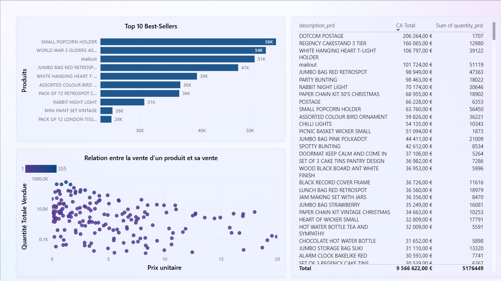

# etl-datawarehouse-analytics
ETL pipeline for building a data warehouse and visualizing insights.

ETL + Data Warehouse + Visualization Project

## Overview
This project builds a complete data pipeline involving:
- Data Extraction from CSV files
- Cleaning & Transformation using Python (Pandas)
- Loading into a MySQL Data Warehouse
- Business Intelligence Dashboard using Power BI

## Architecture
the diagrams of the star schema and the facts tables
the diagrams of the etl process 
the diagram of the whole process of the project ( etl, datawarehousing, visualizing using power bi)
for the diagrams insert the links of the images

## Project Structure
the structure of the whole project 
the steps taken in each branch( ETL, datawarehousing, analytics)

## 📊 Power BI Dashboard Preview

The interactive dashboard is divided into three key analytical views.

### 1. Executive Summary (KPIs & Geo-Distribution)
Overview of the main metrics including Total Revenue (**€9.57M**), Sales Trends over time, and Global Sales Distribution.

### 2. Product Intelligence
Deep dive into product performance, identifying **Best-Sellers** (Top 10) and analyzing the correlation between Unit Price and Sales Volume.

### 3. Customer Segmentation (CRM)
Analysis of customer behavior, showing Top Clients by revenue and detailed country-level performance.

## Technologies Used
- Python (Pandas, MySQL-Connector)
- MySQL (Data Warehouse)
- Power BI (Dashboard)
- Git/GitHub

### Contributors:
- Zhour Ouihlane
- Malak Rhalem
- L'BREK Oumaima
- Iddouch Marwa
- Ililou Laila

